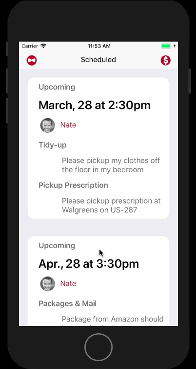
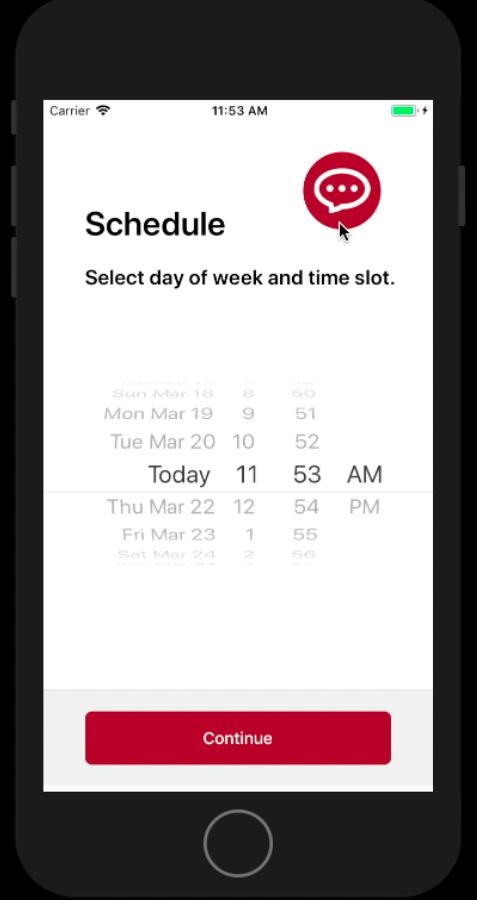
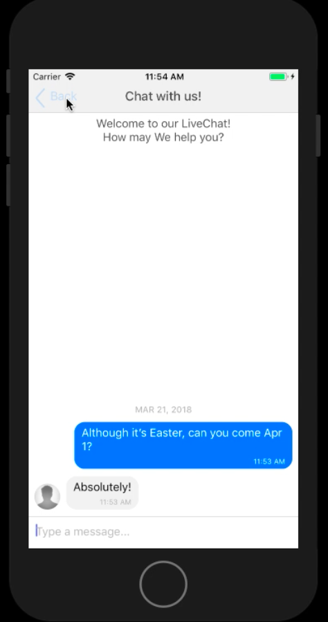
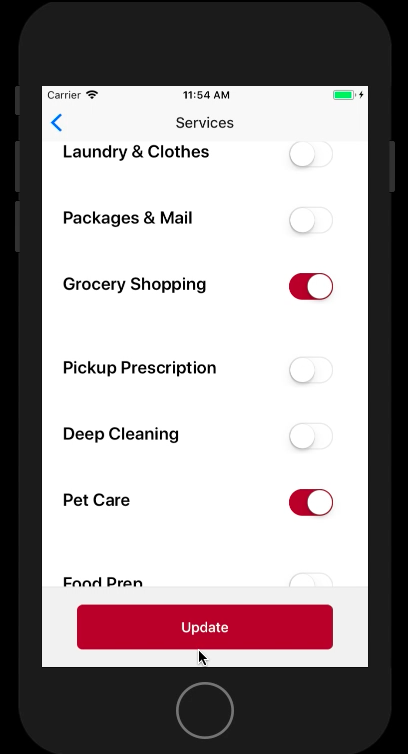
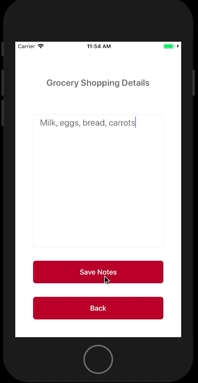
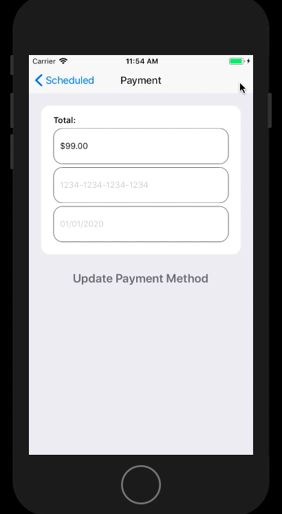

# Pennyworth

Pennyworth is a full-stack application that allows users to schedule an on-demand butler service that caters to their specific needs, whether it is taking out the trash, picking up dry-cleaning, or even meal prepping, you name it and Pennyworth will take care of it. This mobile application enables users to schedule, communicate, and keep track of their upcoming chores while on the go.

## Navigating the Site

Users sign up or sign in and view their dashboard of scheduled Pennyworkers. The dashboard displays the date and time of their scheduled appointment, along with what tasks will be completed.

To schedule a new appointment, the user will select a day and time.

User can directly message their Pennyworker with any questions and concerns.

User can toggle on the services they want to have completed, as well as write any additional notes regarding the service.

User can view the amount they owe and edit their credit card information.

## Project Planning

Task Management: https://trello.com/b/6AOjiCoP/pennyworth

## Technologies

* Javascript/ES6
* React Native
* Redux
* Express
* Knex
* PostgreSQL

## Team Members
* [Olivia Burgener](https://github.com/oaburgener)
